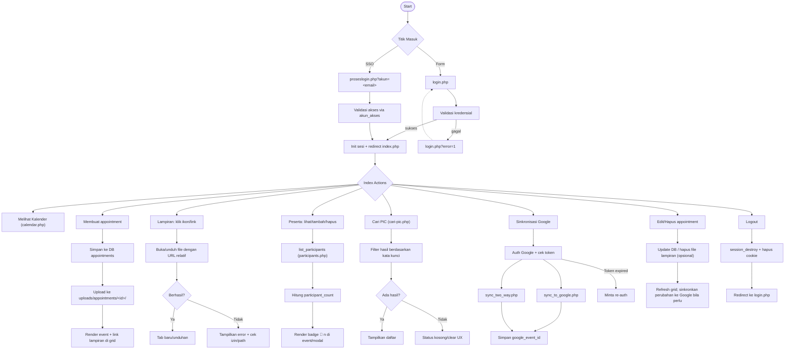
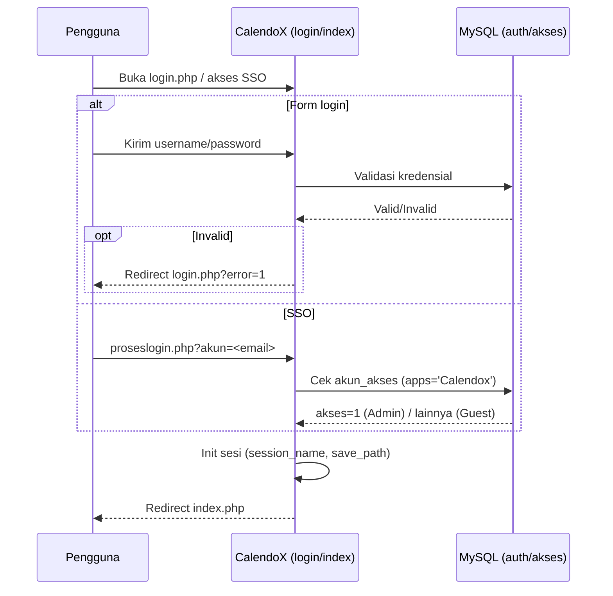
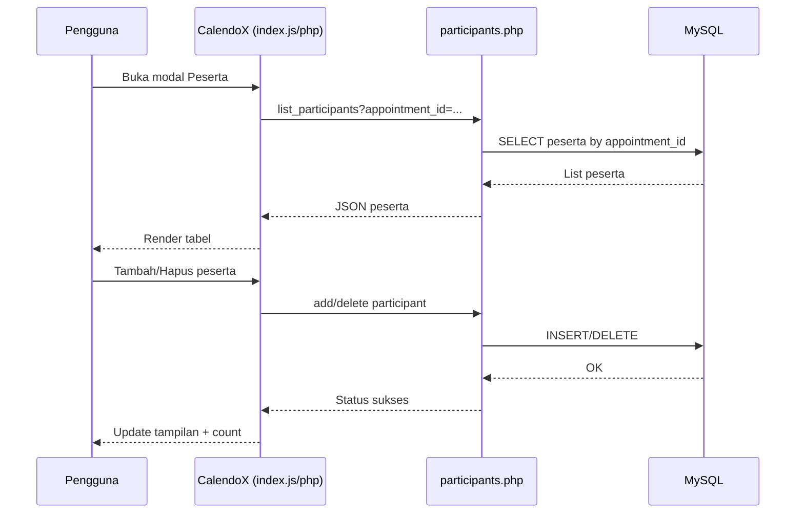
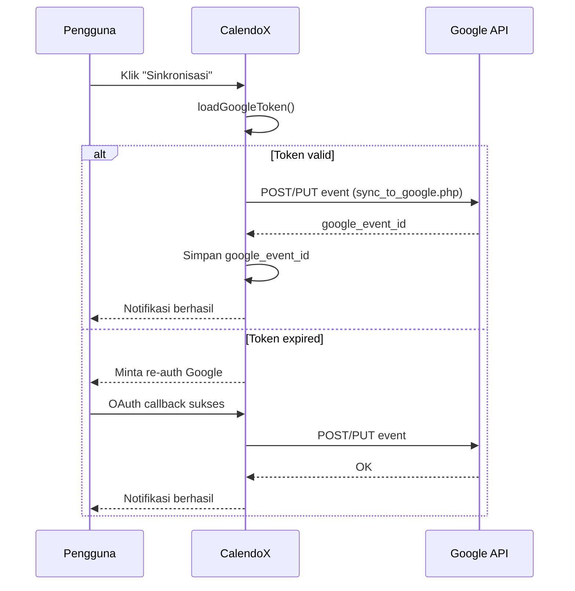
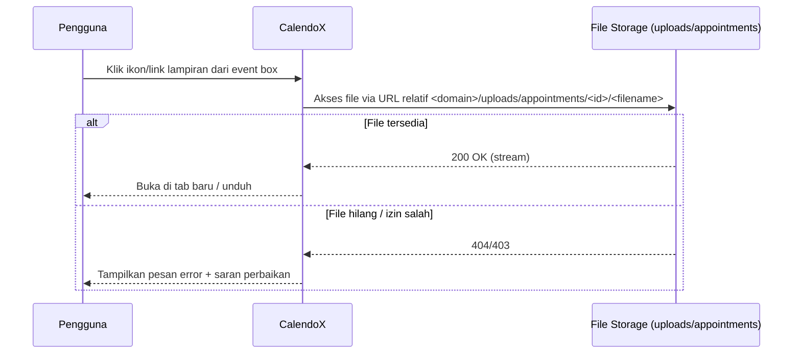

# CalendoX — Diagram User Journey

## Flowchart — Alur Utama

```mermaid
flowchart TD
    A([Start]) --> B{Titik Masuk}
    B -->|Form| C["login.php"]
    B -->|SSO| D["proseslogin.php?akun=&lt;email&gt;"]

    C --> E["Validasi kredensial"]
    D --> F["Validasi akses via akun_akses"]
    E -->|sukses| G["Init sesi + redirect index.php"]
    E -->|gagal| C_ERR["login.php?error=1"]
    C_ERR -.-> C
    F --> G

    G --> H{Index Actions}
    H --> I["Melihat Kalender (calendar.php)"]
    H --> J["Membuat appointment"]
    H --> K["Lampiran: klik ikon/link"]
    H --> L["Peserta: lihat/tambah/hapus"]
    H --> M["Cari PIC (cari-pic.php)"]
    H --> N["Sinkronisasi Google"]
    H --> O["Edit/Hapus appointment"]
    H --> P["Logout"]

    %% Membuat appointment
    J --> J1["Simpan ke DB appointments"]
    J1 --> J2["Upload ke uploads/appointments/&lt;id&gt;/"]
    J2 --> J3["Render event + link lampiran di grid"]

    %% Lampiran
    K --> K1["Buka/unduh file dengan URL relatif"]
    K1 --> K_OK{Berhasil?}
    K_OK -->|Ya| K2["Tab baru/unduhan"]
    K_OK -->|Tidak| K_ERR["Tampilkan error + cek izin/path"]

    %% Peserta
    L --> L1["list_participants (participants.php)"]
    L1 --> L2["Hitung participant_count"]
    L2 --> L3["Render badge 👥 n di event/modal"]

    %% Cari PIC
    M --> M1["Filter hasil berdasarkan kata kunci"]
    M1 --> M_OK{Ada hasil?}
    M_OK -->|Ya| M2["Tampilkan daftar"]
    M_OK -->|Tidak| M_ERR["Status kosong/clear UX"]

    %% Sinkronisasi Google
    N --> N1["Auth Google + cek token"]
    N1 --> N2["sync_to_google.php"]
    N1 --> N3["sync_two_way.php"]
    N2 --> N4["Simpan google_event_id"]
    N3 --> N4
    N1 -->|Token expired| N_ERR["Minta re-auth"]

    %% Edit/Hapus
    O --> O1["Update DB / hapus file lampiran (opsional)"]
    O1 --> O2["Refresh grid; sinkronkan perubahan ke Google bila perlu"]

    %% Logout
    P --> Q["session_destroy + hapus cookie"]
    Q --> R["Redirect ke login.php"]
```

## Sequence — Login & Sesi

```mermaid
sequenceDiagram
    participant U as Pengguna
    participant App as CalendoX (login/index)
    participant DB as MySQL (auth/akses)

    U->>App: Buka login.php / akses SSO
    alt Form login
        U->>App: Kirim username/password
        App->>DB: Validasi kredensial
        DB-->>App: Valid/Invalid
        opt Invalid
            App-->>U: Redirect login.php?error=1
        end
    else SSO
        U->>App: proseslogin.php?akun=<email>
        App->>DB: Cek akun_akses (apps='Calendox')
        DB-->>App: akses=1 (Admin) / lainnya (Guest)
    end
    App->>App: Init sesi (session_name, save_path)
    App-->>U: Redirect index.php
```

## Sequence — Peserta Appointment

```mermaid
sequenceDiagram
    participant U as Pengguna
    participant App as CalendoX (index.js/php)
    participant API as participants.php
    participant DB as MySQL

    U->>App: Buka modal Peserta
    App->>API: list_participants?appointment_id=...
    API->>DB: SELECT peserta by appointment_id
    DB-->>API: List peserta
    API-->>App: JSON peserta
    App-->>U: Render tabel
    U->>App: Tambah/Hapus peserta
    App->>API: add/delete participant
    API->>DB: INSERT/DELETE
    DB-->>API: OK
    API-->>App: Status sukses
    App-->>U: Update tampilan + count
```

## Sequence — Sinkronisasi Google

```mermaid
sequenceDiagram
    participant U as Pengguna
    participant App as CalendoX
    participant G as Google API

    U->>App: Klik "Sinkronisasi"
    App->>App: loadGoogleToken()
    alt Token valid
        App->>G: POST/PUT event (sync_to_google.php)
        G-->>App: google_event_id
        App->>App: Simpan google_event_id
        App-->>U: Notifikasi berhasil
    else Token expired
        App-->>U: Minta re-auth Google
        U->>App: OAuth callback sukses
        App->>G: POST/PUT event
        G-->>App: OK
        App-->>U: Notifikasi berhasil
    end
```

## Sequence — Lampiran

```mermaid
sequenceDiagram
    participant U as Pengguna
    participant App as CalendoX
    participant FS as File Storage (uploads/appointments)

    U->>App: Klik ikon/link lampiran dari event box
    App->>FS: Akses file via URL relatif <domain>/uploads/appointments/<id>/<filename>
    alt File tersedia
        FS-->>App: 200 OK (stream)
        App-->>U: Buka di tab baru / unduh
    else File hilang / izin salah
        FS-->>App: 404/403
        App-->>U: Tampilkan pesan error + saran perbaikan
    end
```